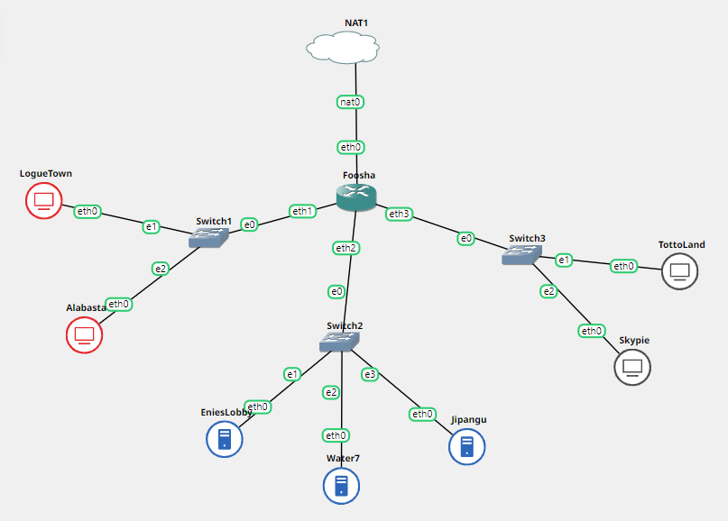
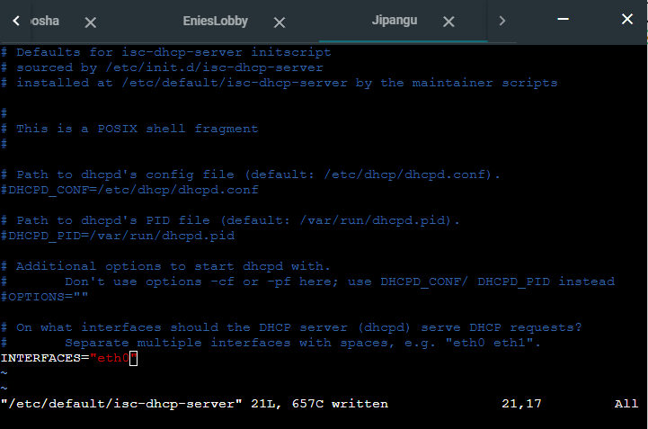
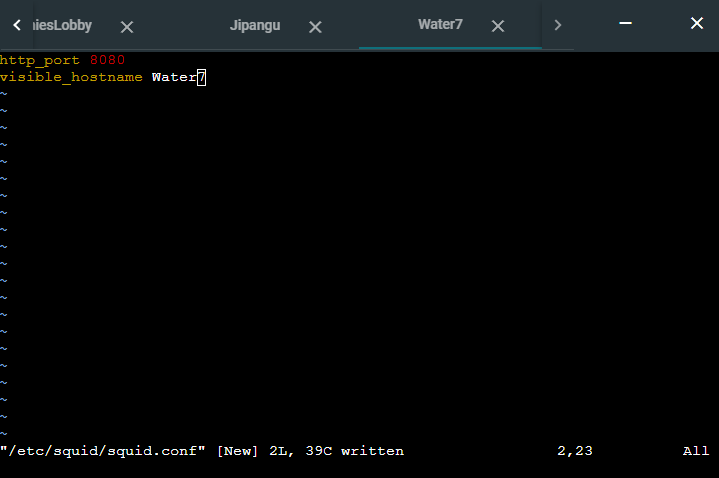
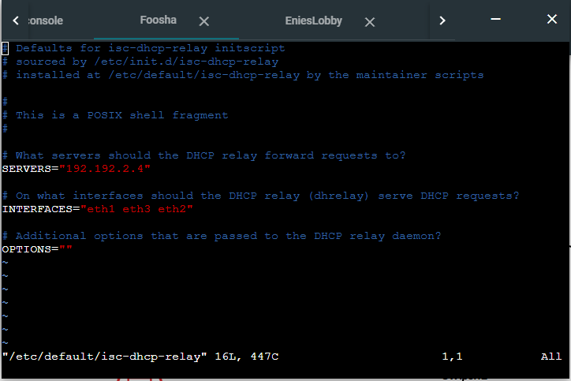
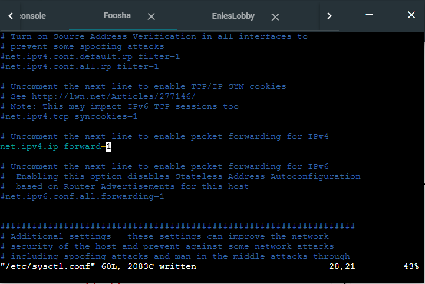
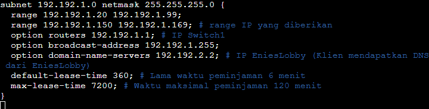
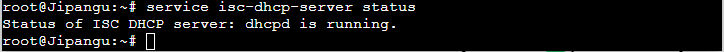
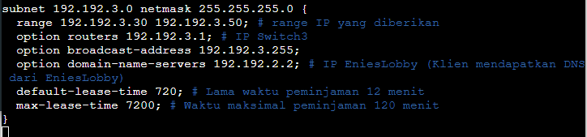

# Jarkom-Modul-3-D01-2021-
Soal : https://docs.google.com/document/d/1hwuI5YpxiP-aboS7wGWPbaQeSOQl0HHVHLT3ws2BPUk/edit



Prefix kelompok D01: `192.192`

Untuk menyambungkan ke internet, jangan lupa:
- Lakukan perintah berikut di router (Foosha)
  ```
  iptables -t nat -A POSTROUTING -o eth0 -j MASQUERADE -s 192.192.0.0/16
  ```
- Samakan nameserver router (Foosha) ke node yang ingin disambungkan dengan internet
  ```
  echo nameserver 192.168.122.1 > /etc/resolv.conf
  ```

### Konfigurasi Network

#### Foosha
```
auto eth0
iface eth0 inet dhcp

auto eth1
iface eth1 inet static
	address 192.192.1.1
	netmask 255.255.255.0

auto eth2
iface eth2 inet static
	address 192.192.2.1
	netmask 255.255.255.0

auto eth3
iface eth3 inet static
	address 192.192.3.1
	netmask 255.255.255.0
```

#### EniesLobby
```
auto eth0
iface eth0 inet static
	address 192.192.2.2
	netmask 255.255.255.0
	gateway 192.192.2.1
```

#### Water7
```
auto eth0
iface eth0 inet static
	address 192.192.2.3
	netmask 255.255.255.0
	gateway 192.192.2.1
```

#### Jipangu
```
auto eth0
iface eth0 inet static
	address 192.192.2.4
	netmask 255.255.255.0
	gateway 192.192.2.1
```

#### LogueTown, Alabasta, Totoland, Skypie
```
auto eth0
iface eth0 inet dhcp
```

## Soal 1
Konfigurasi EniesLobby sebagai DNS Server, Jipangu sebagai DHCP Server, Water7 sebagai Proxy Server

### EniesLobby sebagai DNS Server
Dengan melakukan instalasi berikut yang akan digunakan sebagai DNS Server
```Shell
apt-get update
apt-get install bind9 -y
apt-get install dnsutils -y
```

### Jipangu sebagai DHCP Server
Lakukan instalasi berikut yang akan digunakan sebagai DHCP Server
```Shell
apt-get update
apt-get install isc-dhcp-server -y
```
Menentukan interface di file `/etc/default/isc-dhcp-server`. Pada bagian `INTERFACES=` isi dengan interface yang akan diberi layanan DHCP (sebagai klien DHCP).
Pada kasus ini, yang menjadi klien DHCP adalah Switch1 dan Switch3 melalui eth0 milik Jipangu.
```
INTERFACES="eth0"
```


**Konfigurasi selanjutnya merupakan bagian jawaban soal selanjutnya**

### Water7 sebagai Proxy Server
Lakukan instalasi berikut yang dibutuhkan oleh Proxy Server
```
apt-get update
apt-get install squid -y
apt-get install apache2-utils -y
```
Cek status squid apakah berjalan dengan baik menggunakan command `service squid status`.

Lakukan konfigurasi squid dengan melakukan back-up file konfigurasi default squid.
```
mv /etc/squid/squid.conf /etc/squid/squid.conf.bak
```
Buat konfigurasi squid pada file `/etc/squid/squid.conf` dengan menambahkan script:
```
http_port 8080
visible_hostname Water7
```


Kemudian restart squid dengan perintah `service squid restart`.

## Soal 2
Konfigurasi Foosha sebagai DHCP Relay
### Jawaban
Lakukan instalasi berikut yang akan digunakan DHCP Relay
```
apt-get update
apt-get install isc-dhcp-relay -y
```
Lakukan konfigurasi pada file `/etc/default/isc-dhcp-relay`. Pada bagian `SERVERS=`, masukkan IP milik DHCP Server (Jipangu) dan pada bagian `INTERFACES=` masukkan interface milik DHCP Client dan DHCP Server.
```
SERVERS="192.192.2.4"
INTERFACES="eth1 eth3 eth2"
```


Restart DHCP Relay dengan perintah `service isc-dhcp-relay restart`.<br>
Lakukan konfigurasi pada file `/etc/sysctl.conf` untuk membuka IP Forwarding dengan menghapus komentar pada baris:
```
net.ipv4.ip_forward=1
```


## Soal 3
Client yang melalui Switch1 mendapatkan range IP dari [prefix IP].1.20 - [prefix IP].1.99 dan [prefix IP].1.150 - [prefix IP].1.169.
### Jawaban
#### Jipangu
Melakukan konfigurasi di file `/etc/dhcp/dhcpd.conf` pada DHCP Server (Jipangu). Membuat:
  ```
  subnet 192.192.1.0 netmask 255.255.255.0 {
    range 192.192.1.20 192.192.1.99;
    range 192.192.1.150 192.192.1.169; # range IP yang diberikan
    option routers 192.192.1.1; # IP Switch1
    option broadcast-address 192.192.1.255;
    option domain-name-servers 192.192.2.2; # IP EniesLobby (Klien mendapatkan DNS dari EniesLobby)
    default-lease-time 360; # Lama waktu peminjaman 6 menit
    max-lease-time 7200; # Waktu maksimal peminjaman 120 menit
  }
  ```


Restart DHCP Server dengan perintah `service isc-dhcp-server restart`.<br>
Kemudian cek dengan perintah `service isc-dhcp-server status`.


## Soal 4
Client yang melalui Switch3 mendapatkan range IP dari [prefix IP].3.30 - [prefix IP].3.50
### Jawaban
#### Jipangu
Sama seperti nomer 3, melakukan konfigurasi di file `/etc/dhcp/dhcpd.conf` pada DHCP Server (Jipangu). Membuat:
```
  subnet 192.192.3.0 netmask 255.255.255.0 {
    range 192.192.3.30 192.192.3.50; # range IP yang diberikan
    option routers 192.192.3.1; # IP Switch3
    option broadcast-address 192.192.3.255;
    option domain-name-servers 192.192.2.2; # IP EniesLobby (Klien mendapatkan DNS dari EniesLobby)
    default-lease-time 720; # Lama waktu peminjaman 12 menit
    max-lease-time 7200; # Waktu maksimal peminjaman 120 menit
  }
  ```


Lakukan seperti nomer 3 sebelumnya, restart DHCP Server dengan perintah `service isc-dhcp-server restart`.<br>
Kemudian cek dengan perintah `service isc-dhcp-server status`.

