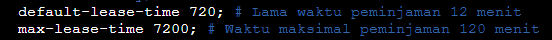

# Jarkom-Modul-3-D01-2021-


Untuk menyambungkan ke internet, jangan lupa:
- Lakukan perintah berikut di router (Foosha)
  ```
  iptables -t nat -A POSTROUTING -o eth0 -j MASQUERADE -s 192.192.0.0/16
  ```
- Samakan nameserver router (Foosha) ke node yang ingin disambungkan dengan internet
  ```
  echo nameserver 192.168.122.1 > /etc/resolv.conf
  ```

### Konfigurasi Network

#### Foosha
```
auto eth0
iface eth0 inet dhcp

auto eth1
iface eth1 inet static
	address 192.192.1.1
	netmask 255.255.255.0

auto eth2
iface eth2 inet static
	address 192.192.2.1
	netmask 255.255.255.0

auto eth3
iface eth3 inet static
	address 192.192.3.1
	netmask 255.255.255.0
```

#### EniesLobby
```
auto eth0
iface eth0 inet static
	address 192.192.2.2
	netmask 255.255.255.0
	gateway 192.192.2.1
```

#### Water7
```
auto eth0
iface eth0 inet static
	address 192.192.2.3
	netmask 255.255.255.0
	gateway 192.192.2.1
```

#### Jipangu
```
auto eth0
iface eth0 inet static
	address 192.192.2.4
	netmask 255.255.255.0
	gateway 192.192.2.1
```

#### LogueTown
```
auto eth0
iface eth0 inet static
	address 192.192.1.2
	netmask 255.255.255.0
	gateway 192.192.1.1
```

#### Alabasta
```
auto eth0
iface eth0 inet static
	address 192.192.1.3
	netmask 255.255.255.0
	gateway 192.192.1.1
```

#### TottoLand
```
auto eth0
iface eth0 inet static
	address 192.192.3.2
	netmask 255.255.255.0
	gateway 192.192.3.1
```

### Skypie
```
auto eth0
iface eth0 inet static
	address 192.192.3.3
	netmask 255.255.255.0
	gateway 192.192.3.1
```

## Soal 1
Konfigurasi EniesLobby sebagai DNS Server, Jipangu sebagai DHCP Server, Water7 sebagai Proxy Server

### EniesLobby sebagai DNS Server
Dengan melakukan instalasi berikut yang akan digunakan sebagai DNS Server
```
apt-get update
apt-get install bind9 -y
apt-get install dnsutils -y
```

### Jipangu sebagai DHCP Server
Lakukan instalasi berikut yang akan digunakan sebagai DHCP Server
```Shell
apt-get update
apt-get install isc-dhcp-server -y
```
Menentukan interface di file `/etc/default/isc-dhcp-server`. Pada bagian `INTERFACES=` isi dengan interface yang akan diberi layanan DHCP (sebagai klien DHCP).

Pada kasus ini, yang menjadi klien DHCP adalah Switch1 dan Switch3 melalui eth0 milik Jipangu.
```
INTERFACES="eth0"
```


Pada file `/etc/dhcp/dhcpd.conf` melakukan konfigurasi dengan menambahkan hal berikut.
```
subnet 192.192.2.0 netmask 255.255.255.0 {
  option routers 192.192.2.4; # IP DHCP Server Jipangu
}
```

**Konfigurasi selanjutnya merupakan bagian jawaban soal selanjutnya**

### Water7 sebagai Proxy Server
Lakukan instalasi berikut yang dibutuhkan oleh Proxy Server
```
apt-get update
apt-get install squid -y
apt-get install apache2-utils -y
```
Cek status squid apakah berjalan dengan baik menggunakan command `service squid status`.

Lakukan konfigurasi squid dengan melakukan back-up file konfigurasi default squid.
```
mv /etc/squid/squid.conf /etc/squid/squid.conf.bak
```
Buat konfigurasi squid pada file `/etc/squid/squid.conf` dengan menambahkan script:
```
http_port 8080
visible_hostname Water7
```


Kemudian restart squid dengan perintah `service squid restart`.

## Soal 2
Konfigurasi Foosha sebagai DHCP Relay
### Jawaban
Lakukan instalasi berikut yang akan digunakan DHCP Relay
```
apt-get update
apt-get install isc-dhcp-relay -y
```
Lakukan konfigurasi pada file `/etc/default/isc-dhcp-relay`. Pada bagian `SERVERS=`, masukkan IP milik DHCP Server (Jipangu) dan pada bagian `INTERFACES=` masukkan interface milik DHCP Client dan DHCP Server.
```
SERVERS="192.192.2.4"
INTERFACES="eth1 eth3 eth2"
```


Restart DHCP Relay dengan perintah `service isc-dhcp-relay restart`.<br>
Lakukan konfigurasi pada file `/etc/sysctl.conf` untuk membuka IP Forwarding dengan menghapus komentar pada baris:
```
net.ipv4.ip_forward=1
```


## Soal 3
Client yang melalui Switch1 mendapatkan range IP dari [prefix IP].1.20 - [prefix IP].1.99 dan [prefix IP].1.150 - [prefix IP].1.169.
### Jawaban
#### Jipangu
Melakukan konfigurasi di file `/etc/dhcp/dhcpd.conf` pada DHCP Server (Jipangu). Membuat:
  ```
  subnet 192.192.1.0 netmask 255.255.255.0 {
    range 192.192.1.20 192.192.1.99;
    range 192.192.1.150 192.192.1.169; # range IP yang diberikan
    option routers 192.192.1.1; # IP Switch1
    option broadcast-address 192.192.1.255;
  }
  ```


Restart DHCP Server dengan perintah `service isc-dhcp-server restart`.<br>
Kemudian cek dengan perintah `service isc-dhcp-server status`.


## Soal 4
Client yang melalui Switch3 mendapatkan range IP dari [prefix IP].3.30 - [prefix IP].3.50

### Jawaban
#### Jipangu
Sama seperti nomer 3, melakukan konfigurasi di file `/etc/dhcp/dhcpd.conf` pada DHCP Server (Jipangu). Membuat:
```
  subnet 192.192.3.0 netmask 255.255.255.0 {
    range 192.192.3.30 192.192.3.50; # range IP yang diberikan
    option routers 192.192.3.1; # IP Switch3
    option broadcast-address 192.192.3.255;
  }
  ```


Lakukan seperti nomer 3 sebelumnya, restart DHCP Server dengan perintah `service isc-dhcp-server restart`.<br>
Kemudian cek dengan perintah `service isc-dhcp-server status`.


## Soal 5
Client mendapatkan DNS dari EniesLobby dan client dapat terhubung dengan internet melalui DNS tersebut.

### Jawaban
#### Mengatur DNS yang diinginkan untuk client
Pada DHCP Server (Jipangu), dilakukan konfigurasi pada file `/etc/dhcp/dhcpd.conf` dengan menambahkan script berikut di subnet untuk Switch1 dan Switch3.
```
option domain-name-servers 192.192.2.2; # IP EniesLobby (Klien mendapatkan DNS dari EniesLobby)
```


#### DNS Forwarder pada EniesLobby untuk menyambungkan ke Internet
Lakukan konfigurasi pada DNS Server (EniesLobby) di file `/etc/bind/named.conf.options`
```
forwarders {
    192.168.122.1; // IP namserver Foosha
};
```
Komentar bagian `// dnssec-validation auto;` dan tambahkan `allow-query{any;};`.


Restart EniesLobby dengan `service bind9 restart`.

## Soal 6
Lama waktu DHCP server meminjamkan alamat IP kepada Client yang melalui Switch1 selama 6 menit sedangkan pada client yang melalui Switch3 selama 12 menit. Dengan waktu maksimal yang dialokasikan untuk peminjaman alamat IP selama 120 menit.

### Jawaban
Perbaharui konfigurasi `/etc/dhcp/dhcpd.conf` pada DHCP Server (Water7). Pada subnet Switch1 menambahkan:
```
default-lease-time 360;
max-lease-time 7200;
```
Dan pada Switch3
```
default-lease-time 720;
max-lease-time 7200;
```
Berikut ini merupakan dokumentasi yang kami tuliskan pada script



Pada DHCP Client (LogueTown, Alabasta, TottoLand, Skypie) dilakukan konfigurasi dengan memberikan komentar konfigurasi lama (IP Statis) pada file `/etc/network/interfaces` dan tambahkan:
```
auto eth0
iface eth0 inet dhcp
```

Restart masing-masing node, kemudian dilakukan pengecekan apakah sudah menggunakan IP yang dipinjamkan dan mendapatkan IP milik EnniesLobby.
- LogueTown

	 
  
- Alabasta

	

- TottoLand

	
	
- Skypie

	


## Soal 7
Luffy dan Zoro berencana menjadikan Skypie sebagai server untuk jual beli kapal yang dimilikinya dengan alamat IP yang tetap dengan IP [prefix IP].3.69<br>
Fixed Address pada DHCP Client Skypie dengan IP 192.192.3.69

### Jawaban
Lakukan konfigurasi di DHCP Server (Jipangu) pada file `/etc/dhcp/dhcpd.conf` dengan menambahkan:
```
host Skypie {
    hardware ethernet b6:e7:28:cb:47:a6;
    fixed-address 192.192.3.69;
}
```


Hardware address milik Skypie bisa dilihat melalui command `ip a`.<br>


Restart DHCP Server dengan perintah `service isc-dhcp-server restart`.

Pada DHCP Client Skypie, tambahkan konfigurasi pada file `/etc/network/interfaces`:
```
hwaddress ether b6:e7:28:cb:47:a6
```


Restart node Skypie dan cek menggunakan `ip a`. DHCP Client Skypie sudah menggunakan IP Address yang dikonfigurasikan sebagai fixed address.<br>


## Soal 8
Loguetown digunakan sebagai client Proxy agar transaksi jual beli dapat terjamin keamanannya, juga untuk mencegah kebocoran data transaksi.
Pada Loguetown, proxy harus bisa diakses dengan nama jualbelikapal.yyy.com dengan port yang digunakan adalah 5000.

### Jawaban
Sebelum menggunakan proxy, buat domain `jualbelikapal.yyy.com` terlebih dahulu di DNS Server (EniesLobby).

Pada EniesLobby, tambahkan konfigurasi berikut pada file `/etc/bind/named.conf.local`.
```
zone "jualbelikapal.d01.com" {
	type master;
	file "/etc/bind/jarkom/jualbelikapal.d01.com";
};
```


Buat folder jarkom dan salin file db.local ke folder jarkom dengan mengubah namanya menjadi jualbelikapal.d01.com. Kemudian lakukan konfigurasi pada file tersebut.
```
mkdir /etc/bind/jarkom
cp /etc/bind/db.local /etc/bind/jarkom/jualbelikapal.d01.com
```
 hrusnya IP Water7 belum ss

Setelah membuat domain di DNS Server (EniesLobby), lakukan konfigurasi lagi di Proxy Server (Water7).<br>
Pada Water7, lakukan konfigurasi pada file `/etc/squid/squid.conf` dengan menambahkan hal berikut.
```
http_port 5000
visible_hostname jualbelikapal.d01.com

http_access allow all
```


Restart squid di Water7 dengan `service squid restart`. Aktifkan proxy server di LogueTown dengan command:
```
export http_proxy="http://jualbelikapal.d01.com:5000"
```
Cek dengan `lynx https://its.ac.id` pada LogueTown.

## Soal 9
Agar transaksi jual beli lebih aman dan pengguna website ada dua
orang, proxy dipasang autentikasi user proxy dengan enkripsi MD51 dengan dua username,
yaitu luffybelikapalyyy dengan password luffy_yyy dan zorobelikapalyyy dengan password zoro_yyy

### Jawaban
Pada Proxy Server (Water7), lakukan konfigurasi penambahan username dan password dengan command berikut.
```
htpasswd -cm /etc/squid/passwd luffybelikapald01
# luffy_d01
htpasswd -m /etc/squid/passwd zorobelikapald01
# zoro_d01
```


Pada file `/etc/squid/squid.conf`, lakukan konfigurasi berikut untuk memberi akses pada user yang telah dibuat.
```
http_port 5000
visible_hostname jualbelikapal.d01.com

auth_param basic program /usr/lib/squid/basic_ncsa_auth /etc/squid/passwd
auth_param basic children 5
auth_param basic realm Proxy
auth_param basic credentialsttl 2 hours
auth_param basic casesensitive on
acl USERS proxy_auth REQUIRED
http_access allow USERS
```


Kemudian restart squid pada Water7 dengan command `service squid restart`.

Untuk mengecek apakah user sudah diaplikasikan, aktifkan proxy pada node LogueTown dengan command berikut.
```
export http_proxy="http://jualbelikapal.d01.com:5000"
```
Kemudian lakukan `lynx https://its.ac.id`. Server akan meminta username dan password untuk mengakses website yang dituju.


## Soal 10
Transaksi jual beli tidak dilakukan setiap hari, oleh karena itu akses internet dibatasi hanya dapat
diakses setiap hari Senin-Kamis pukul 07.00-11.00 dan setiap hari Selasa-Jum’at pukul
17.00-03.00 keesokan harinya (sampai Sabtu pukul 03.00)

### Jawaban
Pada Proxy Server (Water7) lakukan konfigurasi pada file `/etc/squid/acl.conf`untuk menambahkan waktu akses seperti berikut.
```
acl AVAILABLE_WORKING time MTWH 07:00-11:00 # Senin-Kamis 07.00-11.00
acl AVAILABLE_WORKING time TWHF 17:00-23:59 # Selasa-Jumat 17.00-24.00
acl AVAILABLE_WORKING time WHFA 00:00-03:00 # Rabu-Sabtu 24.00-03.00
```
!

Pada file `/etc/squid/squid.conf`, masukkan file acl.conf yang telah dikonfigurasi dengan include dan menambahkan konfigurasi sebagai berikut.
```
include /etc/squid/acl.conf

http_port 5000
visible_hostname jualbelikapal.d01.com

auth_param basic program /usr/lib/squid/basic_ncsa_auth /etc/squid/passwd
auth_param basic children 5
auth_param basic realm Proxy
auth_param basic credentialsttl 2 hours
auth_param basic casesensitive on
acl USERS proxy_auth REQUIRED

#mengaktifkan pembatasan akses waktu
http_access allow USERS AVAILABLE_WORKING
```


Restart squid dengan perintah `service squid restart`.

Pada node LogueTown, cek tanggal. Karena dihari mencoba di luar dari akses waktu, maka saat menggunakan proxy, website tidak bisa diakses.


## Soal 11
Agar transaksi bisa lebih fokus berjalan, maka dilakukan redirect website agar mudah mengingat
website transaksi jual beli kapal. Setiap mengakses google.com, akan diredirect menuju
super.franky.yyy.com dengan website yang sama pada soal shift modul 2. Web server
super.franky.yyy.com berada pada node Skypie

### Jawaban
Sebelum melakukan pembatasan pada google.com, buat webserver super.franky.d01.com pada Web Server (Skypie).

Pada DNS Server EniesLobby, tambahkan konfigurasi berikut pada file `/etc/bind/named.conf.local`.
```
zone "super.franky.d01.com" {
        type master;
        file "/etc/bind/sunnygo/super.franky.d01.com";
};
```


Buat folder /etc/bind/sunnygo dan copy file `/etc/bind/db.local` menjadi `/etc/bind/sunnygo/super.franky.d01.com`.
```
mkdir /etc/bind/sunnygo
cp /etc/bind/db.local /etc/bind/sunnygo/super.franky.d01.com
```

Lakukan konfigurasi berikut pada file `/etc/bind/sunnygo/super.franky.d01.com`.
```
; BIND data file for local loopback interface
;
$TTL    604800
@       IN      SOA     super.franky.d01.com. root.super.franky.d01.com. (
                              2         ; Serial
                         604800         ; Refresh
                          86400         ; Retry
                        2419200         ; Expire
                         604800 )       ; Negative Cache TTL
;
@       IN      NS      super.franky.d01.com.
@       IN      A       192.192.3.69    ; IP Skypie (setelah fixed address)
www     IN      CNAME   super.franky.d01.com.
@       IN      AAAA    ::1
```


Kemudian restart bind9 dengan command `service bind9 restart`.

Pada Web Server Skypie, install hal-hal berikut yang diperlukan untuk melakukan konfigurasi webserver.
```
apt-get update
apt-get install apache2 -y
apt-get install php -y
apt-get install libapache2-mod-php7.0 -y
```

Unduh konten yang dibutuhkan super.franky.d01.com dari https://raw.githubusercontent.com/FeinardSlim/Praktikum-Modul-2-Jarkom/main/super.fran
ky.zip dan lakukan instalasi `wget` dan `unzip`
```
apt-get install wget
wget https://raw.githubusercontent.com/FeinardSlim/Praktikum-Modul-2-Jarkom/main/super.franky.zip
apt-get install unzip
unzip super.franky.zip
```

Copy file `/etc/apache2/sites-available/000-default.conf` menjadi `/etc/apache2/sites-available/super.franky.d01.com.conf` dan lakukan konfigurasi berikut.
```
<VirtualHost *:80>
    ServerAdmin webmaster@localhost
    ServerName super.franky.d01.com
    ServerAlias www.super.franky.d01.com
    DocumentRoot /var/www/super.franky.d01.com

    ErrorLog ${APACHE_LOG_DIR}/error.log
    CustomLog ${APACHE_LOG_DIR}/access.log combined
</VirtualHost>
```


Buat folder DocumenRoot, kemudian copy isi konten yang telah di download ke folder DocumenRoot tersebut.
```
mkdir /var/www/super.franky.d01.com
cp -r /root/super.franky/. /var/www/super.franky.d01.com
```

Aktifkan webserver ddengan command `a2ensite super.franky.d01.com`.

Setelah membuat domain super.franky.d01.com, pada Proxy Server (Water7) tambahkan daftar website yang akan diberi pembatasan akses dengan menulisnya di file `/etc/squid/restrict-sites.acl`. Pada soal ini, hanya google.com.


Tambahkan konfigurasi berikut untuk pembatasan website pada file `/etc/squid/squid.conf`.
```
#mengaktifkan pembatasan website
acl BLACKLISTS dstdomain "/etc/squid/restrict-sites.acl"
http_access deny BLACKLISTS
#menampilkan deny_info sebagai super.franky.d01.com
deny_info http://super.franky.d01.com BLACKLIST
```


Buat Water7 mendapatkan IP EniesLobby dengan command
```
echo 'nameserver 192.192.2.2' > /etc/resolv.conf
```

Kemudian restart squid dengan command `service squid restart`.

Pada LogueTown, aktifnya proxy kemudian cek dengan `lynx google.com`.
